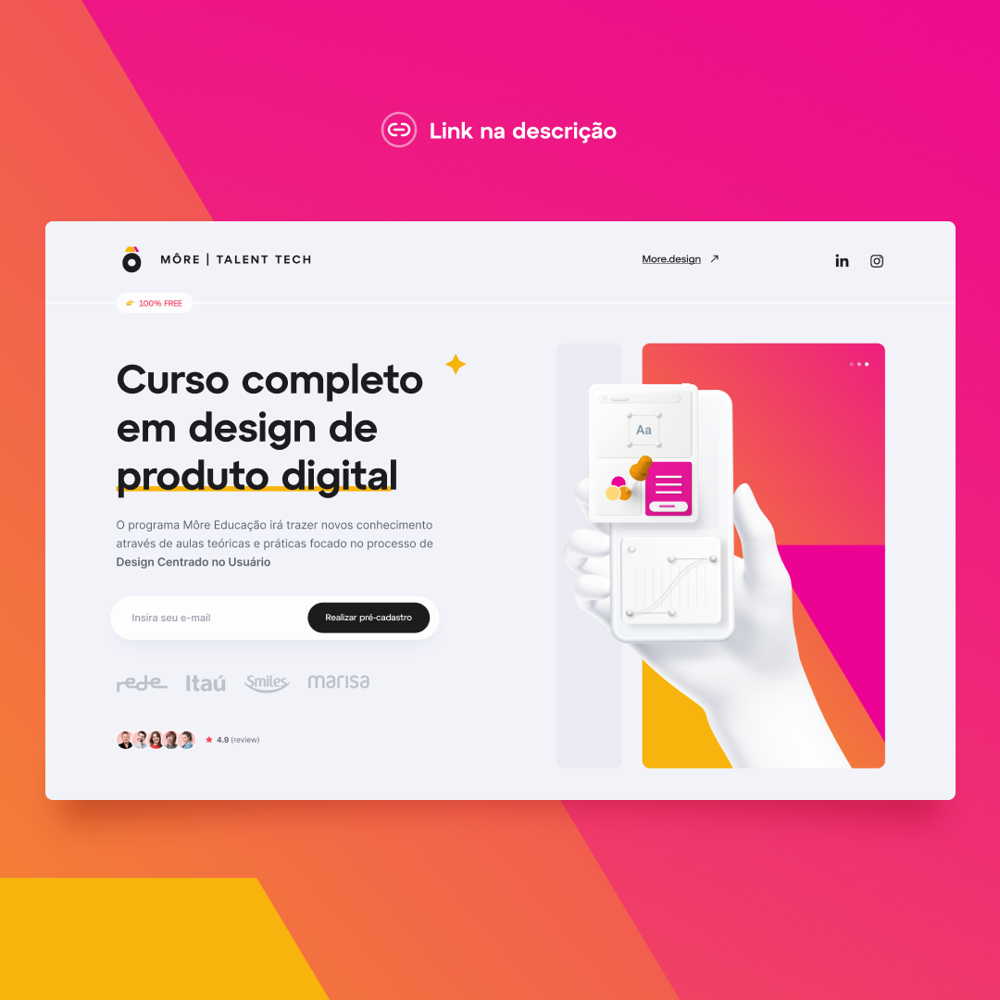

<h1 align="center"> More | Talent Tech</h1>

Landigpage para estudo! 

  <a href="#-tecnologias">Tecnologias</a>&nbsp;&nbsp;&nbsp;|&nbsp;&nbsp;&nbsp;
  <a href="#-projeto">Projeto</a>&nbsp;&nbsp;&nbsp;|&nbsp;&nbsp;&nbsp;
  <a href="#-layout">Layout</a>&nbsp;&nbsp;&nbsp;|&nbsp;&nbsp;&nbsp;
  <a href="#memo-licença">Licença</a>

  

 

  

## 🚀 Tecnologias

Esse projeto foi desenvolvido com as seguintes tecnologias:

- HTML e CSS
- SASS
- Git e Github
- Figma

## 💻 Projeto

Desenvolvimento de uma LandingPage para desktop acompanhando os conceitos ensinados por
Will da plataforma Coodbost.

*Não está responsiva até o momento

## :memo: Licença

Esse projeto está sob a licença MIT.

---

Feito com ♥ by Bruno Ribeiro 
